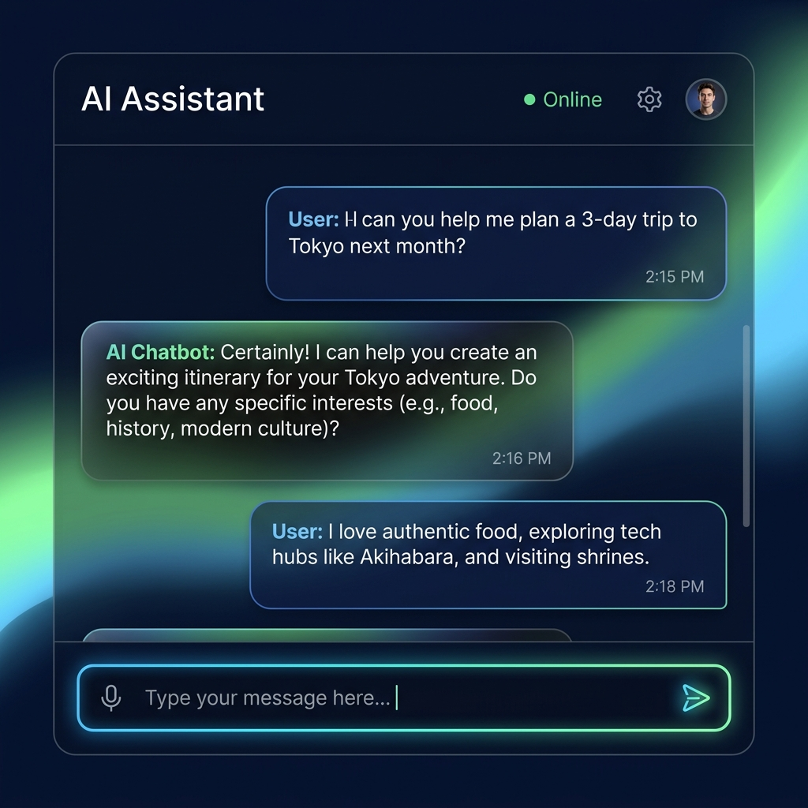

<div align="center">

# 🌟 Premium AI Chatbot 
*A modern, colorful, and lightning-fast Conversational UI built with Streamlit and Groq.*

[](https://share.streamlit.io/deploy?repository=https://github.com/ShajahanImdaad53/AI-CHATBOT&branch=main&main_module_filename=app.py)
[](https://www.python.org/downloads/)
[](https://groq.com)
[](https://opensource.org/licenses/MIT)

</div>

---

## 🎨 UI Preview

Here is a glimpse of the premium aesthetic design featured in this chatbot, which includes an animated gradient background, sleek typography, and glassmorphism UI elements:



## 🚀 About The Project

This is a **High-Performance AI Chatbot Application**. It interfaces directly with **LLaMA 3.1 (8B)** models via the blazing-fast **Groq API** inference layer. 

But it's not just fast—it's beautifully designed. Moving away from the generic vanilla layouts, this application features custom CSS overrides that apply a heavily stylized layout.

### ✨ Key Features
- **Glassmorphism UI:** Blurred chat container backdrops that adapt dynamically to the background.
- **Animated Gradients:** A living, breathing background that smoothly transitions 15 seconds through an infinite loop of dark navy and sky blue color palettes.
- **Modern Typography:** Implements the breathtakingly sleek **Outfit** font hosted straight from Google Fonts.
- **Instant Response Times:** Groq's LPU architecture provides instant token generation for the Llama-3.1-8b model.

---

## 🛠️ Getting Started

To get a local instance up and running on your device, follow these steps:

### Prerequisites
Make sure you have [Python 3.8+](https://www.python.org/downloads/) installed. You will also need to claim a free API key from [Groq Cloud](https://console.groq.com/).

### Installation

1. **Clone the repository:**
   ```bash
   git clone https://github.com/ShajahanImdaad53/AI-CHATBOT.git
   cd AI-CHATBOT
   ```

2. **Set up your Virtual Environment (Recommended):**
   ```bash
   python -m venv venv
   # On Windows:
   .\venv\Scripts\activate
   # On Mac/Linux:
   source venv/bin/activate
   ```

3. **Install the Requirements:**
   ```bash
   pip install -r requirements.txt
   ```

4. **Environment Variables:**
   Create a `.env` file in the root directory if it's not there, and add your API key:
   ```env
   GROQ_API_KEY="your-groq-api-key-here"
   ```

5. **Run the App:**
   ```bash
   streamlit run streamlit_app.py
   ```
   > The app should now be running locally at `http://localhost:8501`.

---

## 🌳 Git Details & Workflow

Since you are maintaining this code natively in the `main` branch, here are the essential Git commands to update your live repository whenever you make local modifications:

#### 1. Check your work status
To see what files you have altered:
```bash
git status
```

#### 2. Stage All Changes
Bundle all your new features and file changes together:
```bash
git add .
```

#### 3. Commit your Changes
Label your bundle with a clear, concise message describing what you built:
```bash
git commit -m "Added a cool new feature to streamlit_app.py"
```

#### 4. Push to GitHub
Finally, push your commit securely to the remote repository located at your GitHub URL:
```bash
git push origin main
```
> **Note:** If it is your first time pushing from the device, Windows or Mac will spawn an authentication pop-up asking you to authorize via GitHub web-login.

---

## 🚀 Deployment (Live Link)

To get your live link via Streamlit Cloud for free:

1. **GitHub:** Click the **"Deploy to Streamlit"** button at the top of this README.
2. **Secrets:** In the Streamlit Cloud deployment settings, go to **Advanced Settings -> Secrets**.
3. **API Key:** Paste your `.env` content or add it manually:
   ```toml
   GROQ_API_KEY = "your_key_here"
   ```
4. **Deploy:** Click **Deploy** and wait for the "lightning-fast" app to spin up!

---

<div align="center">
  <i>Developed with ❤️ using Python and Streamlit</i>
</div>